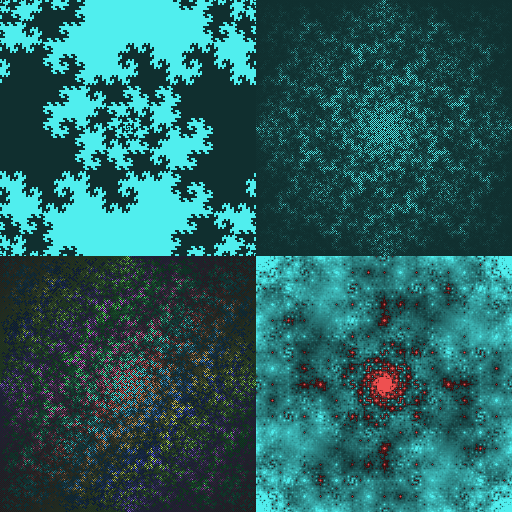

Modifications in this fork
--------------------------

I've made a version of the dragon fractal which tiles nicely
(since in principle the discrete fourier transform operates on a torus).
A consequence of this is that we don't need to take a logarithm to get nice pictures.

I also wanted to know what information was being lost by taking the absolute
value, so I looked at the composition (fft . abs . fft).



The above contains: Top left - the modified dragon (d), Bottom left - fft(d)
Top right - abs(fft(d)), Bottom right fft(abs(fft(d))). All are coloured as
arrays of complex numbers with brightness indicating magnitude and hue
indicating arg(z), so positive real is cyan and negative real is red.

This suggests that quite a bit is changed since the fft should be roughly self-inverse.
Some features are preserved, such as the rotational symmetry, chirality, and the fractal nature.

Experiments with plane-filling curves and Fourier transform
===========================================================

A set of visual experiments: applying Fourier transform to various plane-filling curves.


Running
-------

To generate images, run:
```` sh
$ python fft_experiments.py
````
Or just
```` sh
$ make
````

To change parameters, edit the file fft_experiments.py.


Requirements
------------

Python 3, pillow, numpy.


Tests
-----
Some tests are present. Run
```` sh
$ make test
````
to execute them.
